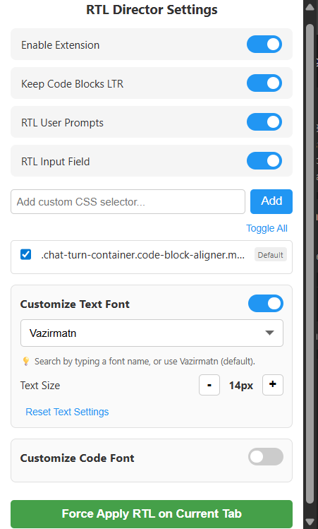
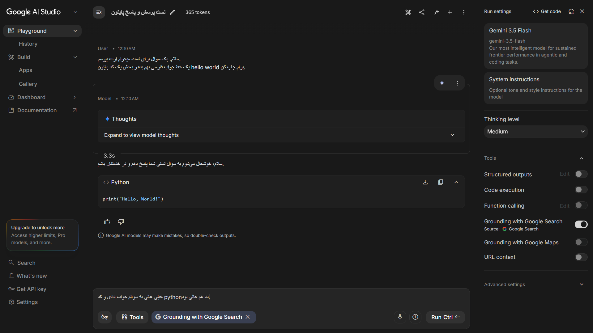
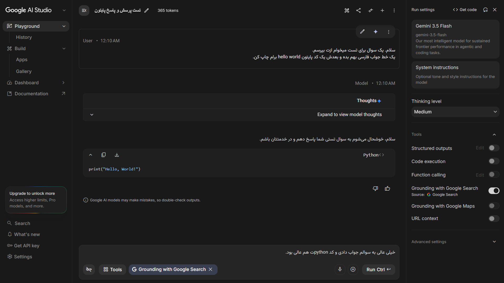

# Google AI Studio RTL 🌐

A lightweight, feature-rich Google Chrome extension designed to bring an optimal RTL (Right-to-Left) experience to **Google AI Studio** and other web applications. It aligns prompts and model outputs to RTL while providing granular control over custom fonts, font sizes, and manual stylesheet injection.

---

## 🚀 Key Features

*   **Automatic RTL Alignment:** Automatically aligns prompt outputs, chat bubbles, and the main user input box (`textarea`) to RTL on Google AI Studio.
*   **Smart Code Block LTR Preservation:** Automatically keeps code blocks (`pre`, `code`, and Google's custom `<ms-code-block>` elements) in LTR layout, ensuring code structure and copy/paste actions are never broken.
*   **Custom CSS Selector Manager:** Easily add, toggle, and delete custom CSS selectors to extend RTL styling on specific elements.
*   **Independent Font & Size Customization:** 
    *   Customize standard text font (defaults to Google's elegant **Vazirmatn** font) and font size.
    *   Customize code block monospace fonts and font sizes independently.
    *   Includes separate **Reset** buttons to instantly revert settings to native baselines.
*   **Material Icon Preservation:** Uses advanced CSS selectors Level 4 (`:not()`) to protect inline Material Icons and Symbol vectors from breaking into raw text when custom fonts are applied.
*   **Manual Override ("Force Apply"):** Manually inject your active RTL styles, custom selectors, and fonts onto *any* active tab/website with a single click.
*   **Chrome Storage Sync:** All choices are automatically persisted inside the Chrome local storage and applied dynamically in real-time.

---

## 📸 Screenshots

To help users visualize the extension, it is recommended to add the following screenshots inside a folder named `screenshots/` in your repository:

### 1. Extension Popup Interface
*Add a screenshot of the popup UI showcasing the toggles, custom selectors, and font settings.*


### 2. Google AI Studio (Before & After RTL)
*Show a comparison of a Persian/Arabic prompt reply with and without the RTL extension active.*
| Before RTL | After RTL |
| :---: | :---: |
|  |  |

---

## 🛠️ Installation (Local/Developer Mode)

Since this extension is optimized for manual local installation, follow these quick steps:

1.  **Download or Clone this Repository:**
    ```bash
    git clone https://github.com/MA-Zarei/Google-AI-Studio-RTL
    ```
2.  Open Google Chrome and navigate to `chrome://extensions/`.
3.  Enable **Developer mode** by toggling the switch in the top-right corner.
4.  Click on the **Load unpacked** button in the top-left corner.
5.  Select the root folder of this project (which contains the `manifest.json` file).
6.  *Optional:* For best results, pin the extension to your Chrome toolbar.
7.  **Important:** Refresh your active Google AI Studio tab after loading or updating the extension.

---

## 💡 How to Use

1.  **Automatic Mode:** Open [Google AI Studio](https://aistudio.google.com/). The extension will automatically run and align your prompts and replies based on your saved settings.
2.  **Custom Font Selection:** Open the popup, toggle "Customize Text Font", and click/type inside the search field. The searchable list will display your system-installed fonts, with *Vazirmatn* pre-loaded at the top.
3.  **Targeting Other Websites:** If you want to RTL-align elements on other sites (like ChatGPT or Claude):
    *   Find the element's CSS selector using Chrome Developer Tools (F12).
    *   Open the popup, type the selector in the "Add custom CSS selector..." input, and click **Add**.
    *   Click **Force Apply RTL on Current Tab** [1].

---

## 📄 License

This project is licensed under the [MIT License](LICENSE).